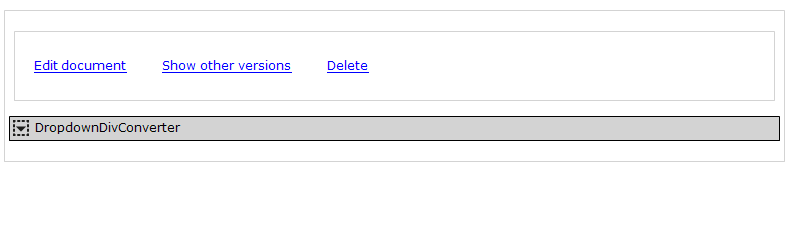

# DropdownDivConverter widget

> **Are you using Mendix 8.2.2 or higher? Consider moving from the DropdownDivConverter to [Dropdown Container](https://appstore.home.mendix.com/link/app/111568/). This resolves any issues with implementing a proper dropdown in React!**

A very easy way of creating custom - Bootstrap based - dropdown menu's. Create whatever you want in the Mendix Modeler and use this as content for the dropdown menu.

## Contributing

For more information on contributing to this repository visit [Contributing to a GitHub repository](https://world.mendix.com/display/howto50/Contributing+to+a+GitHub+repository)!

## Description

The DropdownDivConverter converts a Mendix (div-)container into a - Bootstrap based - dropdown menu with a button. Simply create a container in Mendix with all the content you want in the dropdown menu and the DropdownDivConverter widget as it's last child. Everything you will have added then becomes the content of the dropdown menu.

## Special Split button settings

The split button is a special button combination in Bootstrap: it offers a primary button and pasted onto it a dropdown button offering access to the dropdown menu.
The DropdownDivConverter widget offers two ways of adding behaviour to the primary button:

1. Use a simple microflow without a needed entity: use the Simple Microflow setting and leave the Microflow setting empty.

2. Use a microflow with an entity as it's parameter: use the Microflow and Context object setting to accomplish this.


Note that 'Dropdown button label'-setting will now be used for the label on the primary button instead.

## Implementation steps

1. Create a container element (parent)
2. Create a container element (child) inside this container with all the contents needed in the dropdown menu (including any needed logic).
3. Add the DropdownDivConverter widget to the parent container, after the child container
4. Change the widget settings to accomodate for the wanted behaviour / appearance.

Structure:

```
- Container
  - Container
    - Element for dropdown
    - Element for dropdown
    - etc
  - DropdownDivConverter
```
Example:




## Notes
It's possible to use multiple DropdownDivConverter widgets on the same page. That does mean that the dropdown-menu will be included in the normal HTML contents of the Mendix application. Sometimes this will have the effect that a dataview e.g. does not accomodate any space for the dropdown menu itself. Use the css propery "overflow: visible" to solve this issue.

Since the dropdown menu is based on bootstraps dropdown button it is recommended to follow the applications Bootstrap theming rules with respect to buttons.

## Troubleshooting

*I am getting the error __Unable to destroy:: Error while uninitialize NotFoundError: Failed to execute 'removeChild' on 'Node': The node to be removed is not a child of this node.__*

This unfortunately is a result of changes that occured in Mendix 7.18 and has to do with other elements, such as dynamic texts. These have become React components, which need a parent node. The DropdownDivConverter makes changes in the DOM, which breaks this behavior. In order to fix this, please look at the implementation steps. That should fix your problem.

## Release Notes
Appstore 1.5 release:
- added dynamic titles.
- updated closing behaviour to be compatible with other similar custom widget closing constructions.
- added closing behaviour to split button click.
- updated to enable Mx 6.10+ compatibility.
- updated to support nesting a dropdown in a dropdown (note: set the outer one to non self-closing).
- added the bootstrap link button variant.
- updated the testproject to higher version. Note that this release will therefore not be tested on 5.14.1 anymore.

Appstore 1.4 release:
- added self closing behaviour support for clickable listview (listviews with a microflow 'on click' property).

Appstore 1.3 release:
- added bootstrap glyphicon icon support: just add the "glyphicon-" classname to the settings.

Appstore 1.2 release:
- added dropdown-menu-right option for the dropdown menu realising right aligned dropdown menu's.

Appstore 1.1 release:
- missing callback bug preventing correct reset behaviour (e.g. if a blocking popup is closed).
- dropdown menu internal links will now automatically close the menu.
- new option to prevent auto closing the dropdown menu if clicked on or in the menu.

## More information
http://http://bootstrapdocs.com/v3.0.2/docs/components/#btn-dropdowns
